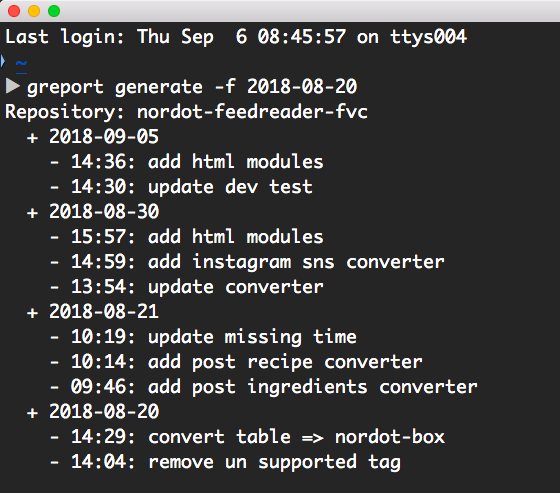

# Git report (greport)

Simple tools to generate daily report from multiple commits and repositories

### Installation

Prerequisite

- [Git](https://git-scm.com/) installed
- `greport` have only been tested on MacOS

Run the following script in your terminal

```sh
curl -fsSL https://raw.githubusercontent.com/vanhtuan0409/git-report/master/install | sh
```

Or manually [download binary file](https://github.com/vanhtuan0409/git-report/releases) and place it into your path

### Basic usage

```sh
# create default config
greport init

# generate report for last 7 days of current directory
greport generate

# generate report from a specific date
greport generate -f 2018-08-01

# generate report from a specific date to a specific date
greport generate -f 2018-08-01 -t 2018-08-10

# view current config
greport config

# view manual
greport help
greport help generate
```

### Config

By default `greport` will generate report within 7 days for all member in current directory. This behaviour can be changed by edit config file `~/.greport/config.yml`

Config variable:

- emails (list): list of emails. When specified `greport` will only collect commits from author with these email.
- repositories (list): list of repository paths on your machine.
- default_time_range (number of days): when there is no `from` option specified, `greport` will collect all commits within default_time_range to now

Example config:

```yml
emails:
  - user1@domain.com
  - user_alias@domain.com
repositories:
  - path_to_repo_1
  - path_to_repo_2
default_time_range: 7
```

### Manual

```
NAME:
   Git Report - Collect git commit messages and organize by days to create a daily report

USAGE:
   greport [global options] command [command options] [arguments...]

VERSION:
   v0.1.0

COMMANDS:
     generate  Generate daily report from commit messages
     init      Initialize config file
     config    Show config file
     help, h   Shows a list of commands or help for one command

GLOBAL OPTIONS:
   --help, -h     show help
   --version, -v  print the version
```

### Screenshot


